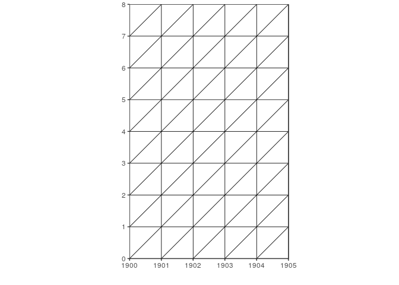
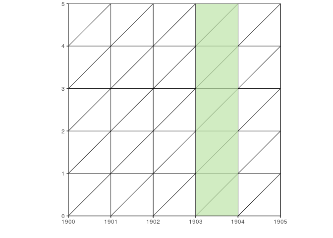
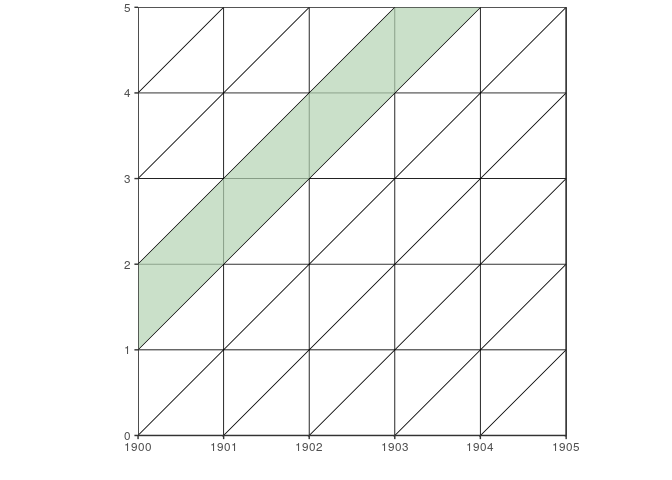
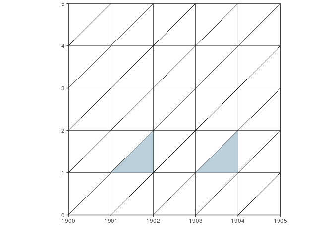
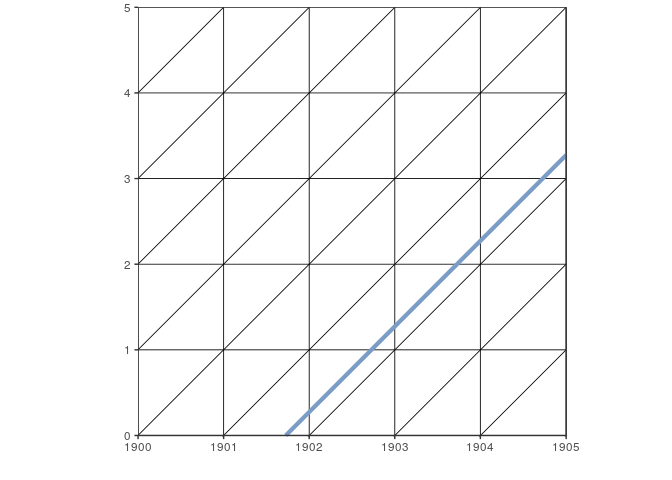
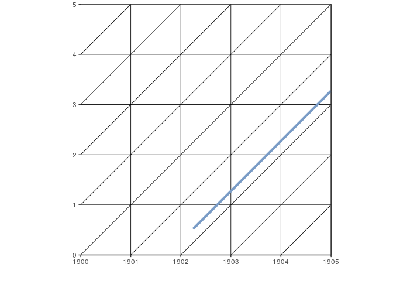
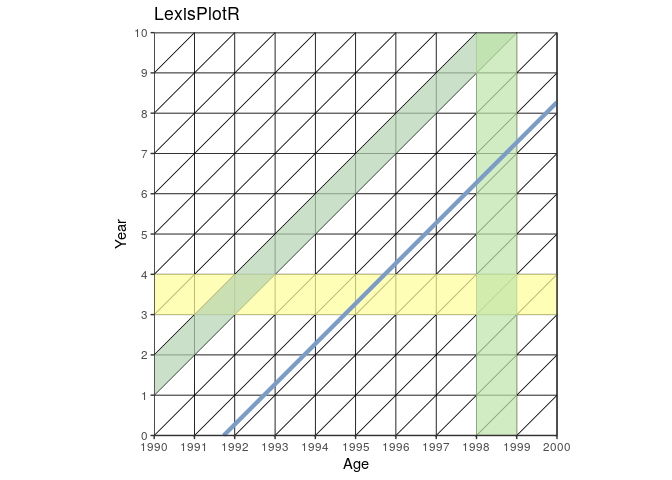

<!-- README.md is generated from README.Rmd. Please edit that file -->
LexisPlotR
==========

[](http://cran.rstudio.com/package=LexisPlotR) [](http://www.r-pkg.org/pkg/LexisPlotR)

`LexisPlotR` is a tool to easily plot Lexis Diagrams within R. It is based on [`ggplot2`](https://github.com/hadley/ggplot2) and wraps necessary steps like drawing the grid, highlighting certain areas or inserting lifelines in a couple of easy to use functions.

### What is a Lexis Diagram?

> In demography a Lexis diagram (named after economist and social scientist Wilhelm Lexis) is a two dimensional diagram that is used to represent events (such as births or deaths) that occur to individuals belonging to different cohorts. Calendar time is usually represented on the horizontal axis, while age is represented on the vertical axis. (<https://en.wikipedia.org/wiki/Lexis_diagram>)

### Major changes from v0.3.\* to v0.4

With v0.4 a complete rewrite of `LexisPlotR` started. To prevent existing code from failing, v0.4 still keeps functions from earlier versions, but only introduces new functionality in functions named using 'snake\_case'. So if you are new to `LexisPlotR` do not use functions named using dot notation (e.g. `lexis.grid()`) but functions using snake\_case (e.g. `lexis_grid()`). If you have existing code using functions from earlier versions of `LexisPlotR` please adapt new function names and syntax where necessary.

### Installation

You can install the latest version of **`LexisPlotR`** by using `install_github()` from the `devtools`-package:

    devtools::install_github("ottlngr/LexisPlotR")
    library(LexisPlotR)

`LexisPlotR` (v0.4) is available on CRAN. Install v0.4 from CRAN:

    install.packages("LexisPlotR")

### Using LexisPlotR

`LexisPlotR` provides a couple of functions to draw Lexis Diagrams in R. Besides the ability to draw empty Lexis grids, `LexisPlotR` also offers some functionality to highlight certain areas of the grid or to add actual data to the Lexis Diagram.

##### Plot an empty Lexis grid

A Lexis Diagram is basically determined by two measures: A range of years presented on the horizontal axis and a range of ages shown on the vertical axis. To plot an empty Lexis grid, use `lexis.grid()` which takes these measures as numeric inputs:

``` r
library(LexisPlotR)
```

``` r
# Plot a Lexis grid from year 1900 to year 1905, representing the ages from 0 to 5
lexis_grid(year_start = 1900, year_end = 1905, age_start = 0, age_end = 5)
```


The aspect ratio of the axes is fixed to ensure right-angled triangles. So even non-square Lexis grids show right-angled triangles:

``` r
lexis_grid(year_start = 1900, year_end = 1905, age_start = 0, age_end = 8)
```



When using wide age and/or date ranges, it may be helpful to define a `delta` specifying the number of years to group in the grid:

``` r
lexis_grid(year_start = 1900, year_end = 1950, age_start = 0, age_end = 50, delta = 5)
```


##### Highlight certain areas of the Lexis grid

Sometimes it is useful to highlight certain areas in the Lexis Diagram, like a certain age, year or cohort.

Highlighting a certain age in your grid is supported by `lexis_age` which will draw a coloured rectangle inside your grid marking all points in the grid belonging to a certain age group.

``` r
lexis <- lexis_grid(year_start = 1900, year_end = 1905, age_start = 0, age_end = 5)
lexis_age(lg = lexis, age = 2)
```


Next to `lexis_age()` there are also `lexis_year()` and `lexis_cohort()` which highlight a certain year or cohort, respectively:

``` r
lexis <- lexis_grid(year_start = 1900, year_end = 1905, age_start = 0, age_end = 5)
lexis_year(lg = lexis, year = 1903)
```



``` r
lexis <- lexis_grid(year_start = 1900, year_end = 1905, age_start = 0, age_end = 5)
lexis_cohort(lg = lexis, cohort = 1898)
```



The similar `lexis_polygon()` can be used to highlight arbitrary regions of the Lexis grid:

``` r
lexis <- lexis_grid(year_start = 1900, year_end = 1905, age_start = 0, age_end = 5)

polygons <- data.frame(group = c(1, 1, 1, 2, 2, 2),
                       x = c("1901-01-01", "1902-01-01", "1902-01-01", "1903-01-01", "1904-01-01", "1904-01-01"),
                       y = c(1, 1, 2, 1, 1, 2))

lexis_polygon(lg = lexis, x = polygons$x, y = polygons$y, group = polygons$group)
```



##### Add life lines to the Lexis Diagram

A life line is a simple tool to represent an individual's life in a Lexis Diagram.

The behaviour of `lexis_lifeline()` can be controlled by supplying an entry and/or exit date along with the individuals birthday:

``` r
lg <- lexis_grid(year_start = 1900, year_end = 1905, age_start = 0, age_end = 5)
lexis_lifeline(lg = lg, birth = "1901-09-23", lwd = 1.5)
```



``` r
lexis_lifeline(lg = lg, birth = "1901-09-23", entry = "1902-04-01", lwd = 1.5)
```



``` r
lexis_lifeline(lg = lg, birth = "1901-09-23", entry = "1902-04-01", exit = "1904-10-31", lwd = 1.5)
```


You can also use entry and death dates from a `data.frame` which is useful when plotting life lines of several individuals or hole populations. **`LexisPlotR`** comes with a random dataset of entry and exit dates for 300 Individuals from 1895 to 1905. Some of the deaths (or exits) are not observed or unknown. Take a look at the `lifelines_sample` dataset:

``` r
data("lifelines_sample")
lifelines_sample <- lifelines_sample[1:30,]
head(lifelines_sample, 10)
```

    ##         entry       exit
    ## 1  1898-04-25 1898-07-30
    ## 2  1899-12-28       <NA>
    ## 3  1903-01-15       <NA>
    ## 4  1901-04-13       <NA>
    ## 5  1895-05-30 1900-03-29
    ## 6  1897-09-22       <NA>
    ## 7  1896-02-16 1896-04-24
    ## 8  1896-11-13 1902-10-30
    ## 9  1904-10-31       <NA>
    ## 10 1899-04-02 1902-04-11

To add all this data to your Lexis Diagram, use `lexis.lifeline()` and provide the respective columns of `lifelines_sample` as arguments:

``` r
lg <- lexis_grid(year_start = 1900, year_end = 1905, age_start = 0, age_end = 5)
lexis_lifeline(lg = lg, birth = lifelines_sample$entry, exit = lifelines_sample$exit, lwd = 1.5, lineends = TRUE)
```


#### Chaining `LexisPlotR` functions

`LexisPlotR` functions can be chained using the pipe operator `%>%` which can be imported from `magrittr`, `dplyr` and other packages.

``` r
library(magrittr)

lexis_grid(year_start = 1990, year_end = 2000, age_start = 0, age_end = 10) %>%
  lexis_age(age = 3) %>%
  lexis_cohort(cohort = 1988) %>%
  lexis_year(year = 1998) %>%
  lexis_lifeline(birth = "1991-09-23", lwd = 1.5)
```


#### `LexisPlotR` is build on top of `ggplot2`

`LexisPlotR` is actually just a collection of wrapper functions encapsulating `ggplot2` logic. Therefore, each plot returned by `LexisPlotR` is an object of class `ggplot` and can be altered using well known `ggplot2` functionalities.

``` r
library(magrittr)
library(ggplot2)

p <- lexis_grid(year_start = 1990, year_end = 2000, age_start = 0, age_end = 10) %>%
  lexis_age(age = 3) %>%
  lexis_cohort(cohort = 1988) %>%
  lexis_year(year = 1998) %>%
  lexis_lifeline(birth = "1991-09-23", lwd = 1.5)

p <- p + labs(x = "Age", y = "Year", "title" = "LexisPlotR")
p
```



#### Use public available data within LexisPlotR

Projects like the [Human Mortality Database (HMD)](https://mortality.org) provide demographic data for many countries in the world.

##### HMD

HMD's Lexis Triangle data can be visualized using `LexisPlotR`'s `lexis_polygon()`. To fetch data from HMD, the [`HMDHFDplus`](https://github.com/timriffe/TR1/tree/master/TR1/HMDHFDplus) package can be used:

``` r
library(LexisPlotR)
library(ggplot2)
library(HMDHFDplus)

triangles <- HMDHFDplus::readHMDweb(CNTRY = "RUS", "Deaths_lexis", Sys.getenv("HMD_USER"), Sys.getenv("HMD_PASSWORD"))

tidy_triangles <- tidy_triangle_data(triangles)

lg <- lexis_grid(1960, 2000, 30, 80, delta = 5)

lg + geom_polygon(data = tidy_triangles, aes(x = x, y = y, group = id, fill = Total))
```

##### Other sources for demographic data

Besides HMD, there are other similar or related projects that provide demographic data that could be used within LexisPlotR. An incomplete list:

-   [Japanese Mortality Database](http://www.ipss.go.jp/p-toukei/JMD/index-en.asp)
-   [Canadian Human Mortality Database](http://www.bdlc.umontreal.ca/CHMD/)
-   [Human Fertility Database](https://www.humanfertility.org/cgi-bin/main.php)
-   ...

Until now, only HMD Lexis Triangles are supported natively by LexisPlotR.

### If you ...

... are missing some functionality, have some ideas how to improve this package or even want to contribute, open an issue here on GitHub or contact me.
